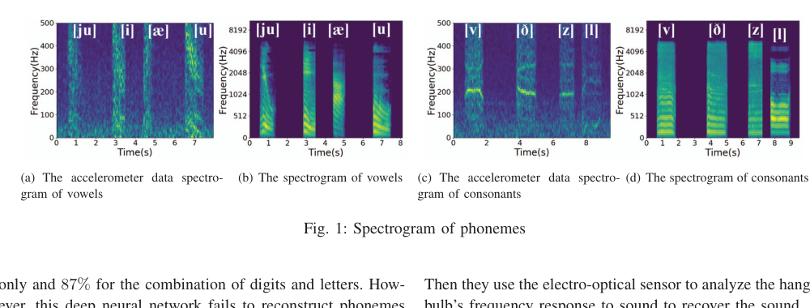
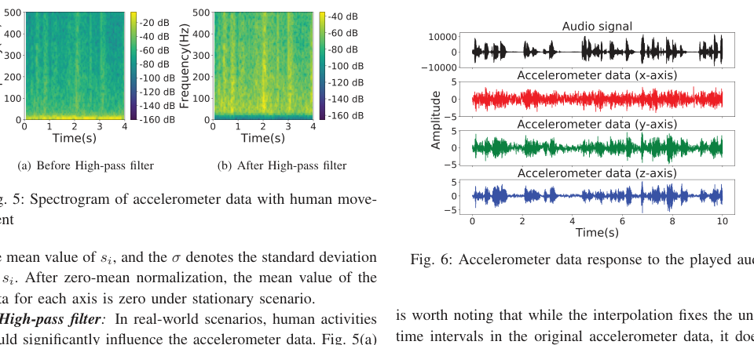
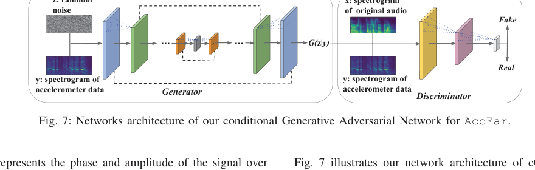
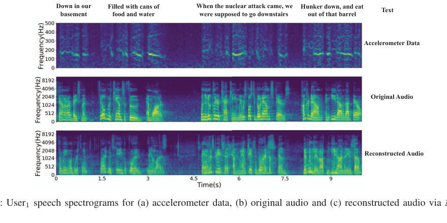

# AccEar: Accelerometer Acoustic Eavesdropping with Unconstrained Vocabulary

This repository contains a PyTorch implementation of **AccEar**, a conditional Generative Adversarial Network (cGAN) pipeline designed to reconstruct human speech from low-frequency accelerometer signals. 

This work is based on the research paper:  
> **AccEar: Accelerometer Acoustic Eavesdropping with Unconstrained Vocabulary**  
> *Pengfei Hu, Hui Zhuang, Panneer Selvam Santhalingam, Riccardo Spolaor, Parth Pathak, Guoming Zhang, and Xiuzhen Cheng*  
> Published in the **2022 IEEE Symposium on Security and Privacy (SP)**.  
> DOI: [10.1109/SP46214.2022.9833716](https://doi.org/10.1109/SP46214.2022.9833716)

---

## 📌 Project Objective

The primary objective of this project is to implement and validate the speech reconstruction pipeline described in the **AccEar** paper. 

Specifically, this project aims to:
1. **Model Side-Channel Vibrations:** Process accelerometer readings (z-axis signals) capturing the physical vibrations propagated through the phone's motherboard when the built-in speaker plays audio.
2. **Reconstruct High-Frequency Audio Components:** Build a **conditional GAN (cGAN)** using a symmetrical U-Net generator (with skip connections) and a PatchGAN-style discriminator to map low-resolution accelerometer spectrograms to full-scale speech Mel spectrograms.
3. **Vocoding/Synthesis:** Employ the Griffin-Lim algorithm to iteratively reconstruct human-perceivable audio waveforms from the generated Mel spectrograms.
4. **Kaggle-Ready Pipeline:** Package the pre-processing scripts, PyTorch models, training routines, and synthetic evaluation pipelines into a single Kaggle-compatible script (`accear_cgan_kaggle.py`) and notebook (`accear_cgan_notebook.ipynb`) to leverage cloud GPUs.

---

## 📖 Key Details from the Paper

### 1. Threat Model & Background
Mobile operating systems restrict microphone access behind explicit user permissions. However, **motion sensors (accelerometers and gyroscopes) are unrestricted**. Since smartphone speakers produce strong physical vibrations that propagate through the motherboard, an attacker running a background app can record accelerometer readings to eavesdrop.

Unlike previous classification-based attacks that only recognize a pre-trained set of hot-words (closed vocabulary), **AccEar is the first system to achieve acoustic eavesdropping with an unconstrained vocabulary**.

  
*Figure 1: Comparison of phoneme signatures between low-frequency accelerometer data and the corresponding audio spectrograms.*

### 2. AccEar Architecture
The attack workflow is structured into two main components:
* **Feature Extraction:** Pre-processing raw 3-axis accelerometer data (zero-mean normalization, high-pass filtering at 20Hz to eliminate human movement noise, linear interpolation to 1kHz, and STFT conversion on the z-axis).
* **Speech Reconstruction (cGAN):** A network that learns the mapping from the accelerometer condition to the target audio Mel spectrogram.

  
*Figure 4: The overall architecture of the AccEar eavesdropping system.*

### 3. Model Architecture
* **Generator:** Utilizes a U-Net architecture with convolutional downsampling layers and upsampling layers connected via skip-connections to retain low-level feature information.
* **Discriminator:** Classifies local patches ($30 \times 30$) instead of the entire image to enforce fine-grained structural alignment.

  
*Figure 7: Detailed network architecture of the conditional GAN for AccEar.*

### 4. Key Findings & Performance
Evaluations conducted using speech datasets from 16 public personalities across English and Chinese showed:
* Average **Mel-Cepstral Distortion (MCD)** of **4.784** (values under 8 are generally intelligible to speech recognition systems).
* Average **Mean Opinion Score (MOS)** of **3.637** (subjective similarity rating).
* Average **Word Error Rate (WER)** of **13.434%** on reconstructed speech.

  
*Figure 8: Speech spectrogram comparison between: (a) raw accelerometer data, (b) original audio ground truth, and (c) audio reconstructed via AccEar.*

---

## 📂 Project Structure

* `accear_cgan_kaggle.py`: Self-contained PyTorch training and inference script tailored for Kaggle environments.
* `accear_cgan_notebook.ipynb`: Jupyter notebook for interactive execution and visualization.
* `requirements.txt`: Python package dependencies.
* `images/`: Cropped high-resolution figures extracted from the original paper.
* `README_KAGGLE.md`: Step-by-step user deployment guide for Kaggle.

---

## 🚀 Running the Pipeline

To run the PyTorch cGAN pipeline locally or on Kaggle:

### 1. Install Dependencies
```bash
pip install -r requirements.txt
```

### 2. Run Training/Inference
```bash
python accear_cgan_kaggle.py --epochs 200 --batch-size 16 --checkpoint-dir ./checkpoints
```
If the `StealthyIMU` dataset is not present locally, the code will automatically default to generating synthetic Speech and IMU signal pairs to verify the end-to-end correctness of your model execution.
